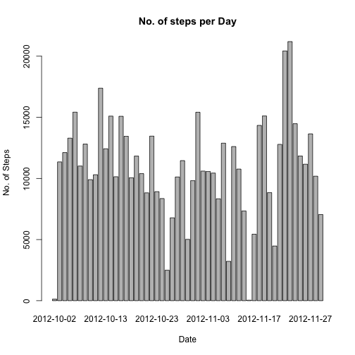
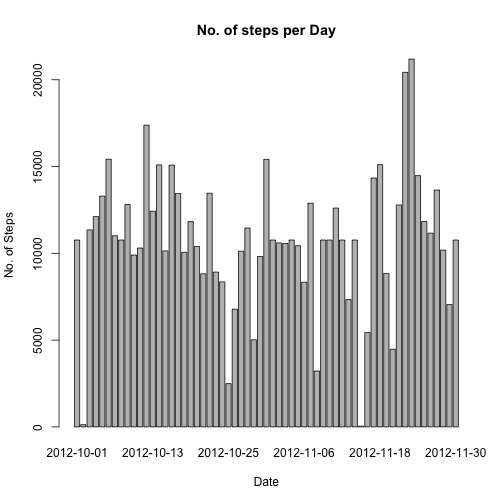

This document outlines the solution to Project 1 of **Reproducible Research**

**Loading and preprocessing the data**

Load the data and process/transform the data (if necessary) into a format suitable for my analysis.


```r
#Read in data
steps<-read.csv("activity.csv")

#Ensure dates are in the correct date format
steps$date<-as.Date(steps$date, "%m/%d/%y")
```

**What is mean total number of steps taken per day?**

Make a histogram of the total number of steps taken each day


```r
#Aggregate the number of steps per day
steps.sum<-aggregate(.~date,data=steps, FUN=sum)

#Make a histogram of the total number of steps taken each day
barplot(steps.sum$steps, names.arg=steps.sum$date, xlab="Date", ylab="No. of Steps", main="No. of steps per Day")
```

 

Calculate and report the mean and median total number of steps taken per day.


```r
#Calculate and report the mean and median total number of steps taken per day
steps.mean<-mean(steps.sum$steps)
steps.median<-median(steps.sum$steps)
```

The mean number of steps taken per day was 1.0766 &times; 10<sup>4</sup>.
The median number of steps taken per day was 10765.

**What is the average daily activity pattern?**

Make a time series plot (i.e. type = "l") of the 5-minute interval (x-axis) and the average number of steps taken, averaged across all days (y-axis).


```r
#Calculate the average number of steps per 5 minute interval over all days
steps.5min<-aggregate(.~interval, data=steps, FUN=mean)

with(steps.5min, plot(interval, steps, type="l", xlab="Interval", ylab="Steps", main="Average number of steps per time interval"))
```

 

Which 5-minute interval, on average across all the days in the dataset, contains the maximum number of steps?


```r
  #Order in descending order by number of steps and return the first value
sorted<-steps.5min[order(-steps.5min$steps),]
timeint<-sorted[1,1]
```
The 5-minute interval with the maximum number of steps was 835.

**Imputing missing values**

Calculate and report the total number of missing values in the dataset (i.e. the total number of rows with NAs)


```r
NAs<-steps[steps$steps=="NA",]
count<-nrow(NAs)
```
The number of missing values in the dataset was 2304.

*Devise a strategy for filling in all of the missing values in the dataset.*

I have decided to replace all NAs with that interval's corresonding average over all days. 

```r
  #Create a subset with rows which do not contain NA's
notNA<-subset(steps[!is.na(steps$steps),])

  #Create a subset with only NAs and merge with the mean data for each 5 min interval
isNA<-subset(steps[is.na(steps$steps),])
merged<-merge(isNA, steps.5min, by="interval")
  #Reshape merged dataset to resemble original dataset
reshaped<-subset(merged[,c(1,3,4)])

  #Change names of columns so we can use rbind later
names(reshaped)[names(reshaped)=="date.x"]<-"date"
names(reshaped)[names(reshaped)=="steps.y"]<-"steps"

  #Rejoin all the data
steps.imputed<-rbind(reshaped,notNA)
```

Make a histogram of the total number of steps taken each day


```r
  #Aggregate the number of steps per day
steps.imputedsum<-aggregate(.~date,data=steps.imputed, FUN=sum)

  #Histogram
barplot(steps.imputedsum$steps, names.arg=steps.imputedsum$date, xlab="Date", ylab="No. of Steps", main="No. of steps per Day")
```

 

Calculate and report the mean and median total number of steps taken per day.


```r
  #Mean and Median - the sames as earlier because NAs replaced with the mean of each interval
mean(steps.imputedsum$steps)
median(steps.imputedsum$steps)
```

The new mean is 1.0766 &times; 10<sup>4</sup> and the median is 1.0766 &times; 10<sup>4</sup>.
*There is no change to the mean or medium as the NAs were replaced with interval averages.*

**Are there differences in activity patterns between weekdays and weekends?**

Create a new factor variable in the dataset with two levels – “weekday” and “weekend” indicating whether a given date is a weekday or weekend day.

```r
  #First, create a new variable for the day of the week and whether it is a weekday or weekend.
  #Finally, make it a factor variable
steps.imputed$dayofweek<-weekdays(steps.imputed$date)
steps.imputed$daycat[steps.imputed$dayofweek %in% c("Monday", "Tuesday", "Wednesday", "Thursday", "Friday")] <- "weekday"
steps.imputed$daycat[steps.imputed$dayofweek %in% c("Saturday", "Sunday")] <- "weekend"
steps.imputed$daycat<-factor(steps.imputed$daycat)
```

Make a panel plot containing a time series plot (i.e. type = "l") of the 5-minute interval (x-axis) and the average number of steps taken, averaged across all weekday days or weekend days (y-axis).


```r
  #Create a subset called newdata which just contains the variables required
vars<-c("interval", "daycat", "steps")
newdata<-steps.imputed[vars]
  #Calculate the average number of steps per 5 minute interval over all days
steps.imputedaverage<-aggregate(.~interval+daycat, data=newdata, FUN=mean)

  #Generate the plot using the Lattice system
library("lattice")
xyplot(steps ~ interval | daycat, data=steps.imputedaverage, layout=c(1,2), type="l")
```

 

